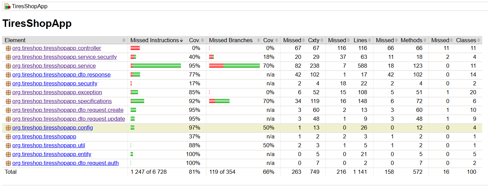
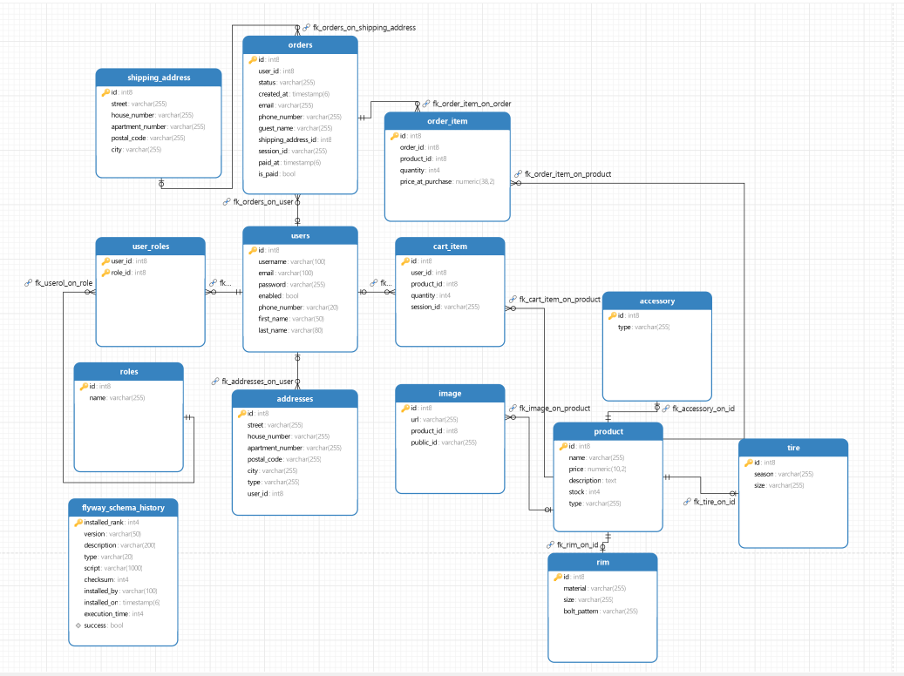

# Tires Shop App

System sprzedaży opon, felg i akcesoriów motoryzacyjnych planowo, z panelem 
klienta i administracyjnym. Projekt stworzony jako aplikacja webowa REST 
z wykorzystaniem Spring Boot, Spring Security, Hibernate, JWT 
oraz dokumentacji Swagger UI.  

Aplikacja frontowa zbudowana z wykorzystaniem Reacta, TS, Vite, komunikuje się z backendem 
z wykorzystaniem axiosInstance.

Aplikacja wykorzystuje token: `bearerAuth  (http, Bearer) JWT auth` oraz Header `X-Client-Id` dla klienta niezalogowanego.

---

## Tech Stack

- **Frontend**: React, TypeScript, Vite, React Router
- **Backend**: Spring Boot, Spring Security, JWT, Hibernate, JPA, Maven
- **Baza danych**: PostgreSQL
- **DevOps**: Docker, Flyway, Cloudinary

---

## 🚀 Getting Started

### 1. Sklonuj repozytorium

```bash
    git clone https://github.com/danielryz/TIRES-SHOP
    cd TIRES-SHOP
```

### 2. Ustaw dane dostępowe do cloudinary do dodawania zdjęć w clodinary (opcjonalne) `src/main/resources/application.properties`  

   Jeśli nie ustawisz nie będzie dało się korzystać z endpointu do Uploadu zdjęć.

```properties
cloudinary.cloud-name=yourCloudName
cloudinary.api-key=yourApi
cloudinary.api-secret=yourSecret
```


### 3. Uruchom aplikację:

#### Instalacja dockera
1. Windows: https://docs.docker.com/desktop/setup/install/windows-install/
2. Mac: https://docs.docker.com/desktop/setup/install/mac-install/
3. Linux: https://docs.docker.com/desktop/setup/install/linux/

```bash
    docker-compose build  
    docker-compose up
```


### 4. Wejdź na:
- Dokumentacja swagger: http://localhost:8080/swagger-ui/index.html
- Panel klienta: http://localhost:5174/
- Panel ADMINA: http://localhost:5174/admin

---

## Bezpieczeństwo i autoryzacja

Aplikacja wykorzystuje:
- JWT do logowania i autoryzacji
- Role użytkowników: `USER`, `ADMIN`
- Role przypisywane podczas rejestracji (domyślnie: `USER`)
- Endpointy zabezpieczone adnotacjami `@PreAuthorize`

- Niektóre endpointy, koszyk, składanie zamówienia, wykorzystują Header - clientId - generowany 
automatycznie przez clientId.ts na froncie losowe uuid jeśli istnieje to jest pobierane z Local storage

---

## 📁 Struktura Projektu

### 🖥️ Frontend – `TiresShopFrontend`
Technologie: `React`, `TypeScript`, `Vite`, `Docker`, `Nginx`

<pre>
TiresShopFrontend/
├── public/ # Pliki statyczne (index.html, favicon, manifest)
├── src/
│ ├── api/ # Komunikacja z backendem (axios)
│ ├── assets/ # Obrazy, ikony, logotypy
│ ├── components/ # Komponenty UI (np. przyciski, modale)
│ ├── context/ # React Contexts (np. koszyk, autoryzacja)
│ ├── pages/ # Widoki strony (Home, Product, Cart, Admin itd.)
│ ├── routes/ # Trasy + ochrona (PrivateRoute, AdminRoute)
│ ├── types/ # Typy TypeScript (User, Tire, Product)
│ └── utils/ # Funkcje pomocnicze
├── vite.config.ts # Konfiguracja Vite
├── tsconfig.json # Konfiguracja TypeScript
├── Dockerfile # Obraz frontendu
└── nginx.conf # Konfiguracja Nginx do serwowania frontendu
</pre>

### 🧠 Backend – `TiresShopApp`

Technologie: `Spring Boot`, `Maven`, `JWT`, `JPA`, `Flyway`, `Cloudinary`, `Docker`
<pre>
TiresShopApp/
├── src/
│ ├── main/
│ │ ├── java/org/tireshop/tiresshopapp/
│ │ │ ├── config/ # Konfiguracje (Security, CORS, OpenAPI)
│ │ │ ├── controller/ # REST API – endpointy
│ │ │ ├── dto/ # DTO (request / response)
│ │ │ ├── entity/ # Encje JPA
│ │ │ ├── exception/ # Obsługa wyjątków
│ │ │ ├── repository/ # Interfejsy JPA
│ │ │ ├── security/ # JWT, filtry, konfiguracja Spring Security
│ │ │ ├── service/ # Logika biznesowa
│ │ │ ├── specifications/ # Dynamiczne filtrowanie i sortowanie
│ │ │ └── util/ # Narzędzia pomocnicze
│ ├── resources/
│ │ ├── application.properties # Konfiguracja aplikacji
│ │ └── db/migration/ # Migracje Flyway
│
│ └── test/ # Testy jednostkowe i integracyjne
├── Dockerfile # Obraz backendu
└── pom.xml # Zależności Maven
</pre>
---

## Opis funkcjonalności

Użytkownik nie zalogowany:
1. Logowanie i Rejestracja z wykorzystaniem Spring Security, po zalogowaniu i rejestracji tworzy się Token JWT, na froncie jest on zapisywany w `local storage`.
2. Przeglądanie produktów, filtrowanie produktów, odzielne endpointy dla Product, Tire, Rim, Accessory.
3. Dodawanie do koszyka, składanie zamówienia, do których jest wykorzystywany Header `X-Client-Id`.

Użytkownik zalogowany tylko z `ROLE_USER`:
1. Wszystkie opisane wyżej.
2. Dostęp do niektórych, endpointów z UserController oraz do wszystkich z AddressController.
3. Dostęp na froncie do Strony Profilowej, w której może, usunąć konto, dodać, usunąć, zaktualizować Adresy, a także zmienić niektóe dane użytkownika, a także zmienić hasło.

Użytkownik zalogowany z `ROLE_ADMIN`:
1. Dostęp do endpointów Admina - nie jest dublowany jeśli nie ma roli `ROLE_USER`, to nie będzie miał dostępu do endpointów dla USERA.
2. Dodawanie i Aktualizacja produktów, na froncie dostęp do Panelu Admina
3. Usuwanie i zmiana roli użytkownikom, podgląd użytkowników
4. Podgląd zamówień, zmiana statusu zamówień.

---

## Testy

Aplikacja została otestowana w 81%, za pomocą `testów jednostkowych` i `testów integracyjnych`

Wyniki Jacoco:


(Planuje zautomatyzować narazie nie zdążyłem);
Aby przetestować aplikacje, należy wejść do folderu:
```bash
cd TiresShopApp
```
A następnie w application.properties użyć konfiguracji bazy danych jak poniżej:
```properties
# Database PostgresSQL
#For test
spring.datasource.url=jdbc:postgresql://localhost:5432/tire_shop
#For docker
#spring.datasource.url=jdbc:postgresql://db:5432/tire_shop
```
Do tego celu należy stworzyć bazę localną PostgreSQL:

zalogowac się jako postgres
```bash
psql -U postgres 
```
```sql
CREATE DATABASE tire_shop;
CREATE USER myuser WITH PASSWORD 'pass';
GRANT ALL PRIVILEGES ON DATABASE tire_shop TO myuser;
\c tiresshop_local

--opcjonalnie
ALTER SCHEMA public OWNER TO myuser;
GRANT ALL ON SCHEMA public TO myuser;
GRANT ALL PRIVILEGES ON ALL TABLES IN SCHEMA public TO myuser;
GRANT ALL PRIVILEGES ON ALL SEQUENCES IN SCHEMA public TO myuser;
ALTER DEFAULT PRIVILEGES IN SCHEMA public GRANT ALL ON TABLES TO myuser;
```
I uruchomić testy:
```bash
mvn clean verify 
```

---
## Schemat Bazy



---

## Autor

Projekt stworzony jako projekt zaliczeniowy.  
Daniel Ryż 
---

## Status

Projekt w trakcie rozwoju.

